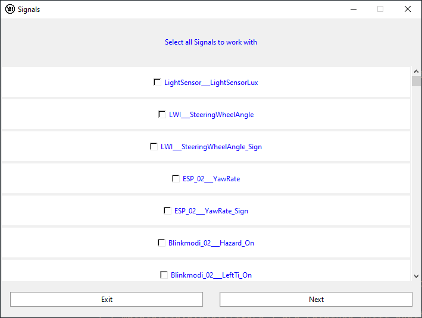

# Video Desktop App

A Desktop app for Valeo Vision.

## Pre-requisites

The project is written in ```python3```, so if you have another version, upload it [here](https://www.python.org/downloads/)

The project uses differents open source libraries like ```tkinter```,  ```pandas```, ```opencv```, ```matplotlib``` and ```PILL```.

if you use ```pip``` method, you don't have to worry about installing dependencies yourself, The ```launcher.py``` does it automatically !

For ```conda``` users, you can install them manually by :
```
conda install pandas tk opencv-python matplotlib pillow
```

## Run the Project

First, we need to clone the repository
```
git clone https://github.com/napoknot21/video-desktop-app.git
```
We enter to the cloned directory
```
cd video-desktop-app
```
We run ```launcher.py``` file 
```
python3 launcher.py
```

## How to use it ?
This desktop app was created in order to automate the labeling of the simulation videos

### First steps 
When we run the ```launcher.py```, we'll have the *browser window*.


We have to select a *video* file (the simulation video) and a *CSV* file (the data).

Once selected, then we can start !

Then, we have to select all signals to work with (from th csv file) so make sure that select the goog csv file ! 

We're supposed to have a window like this :


