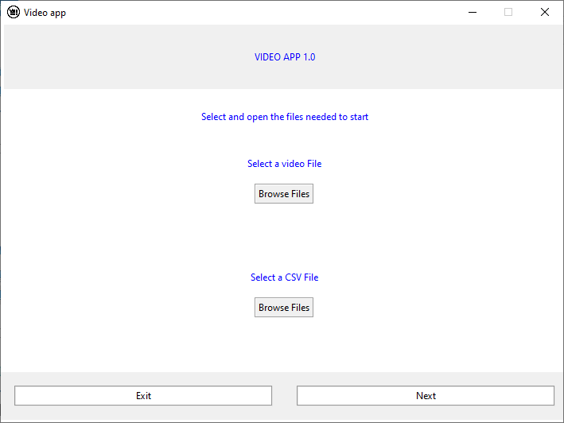
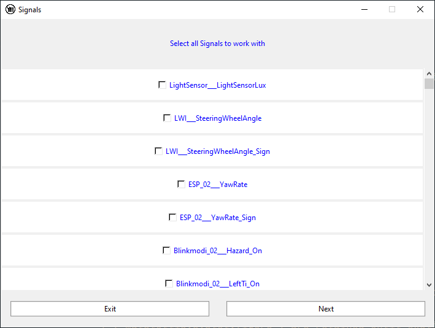
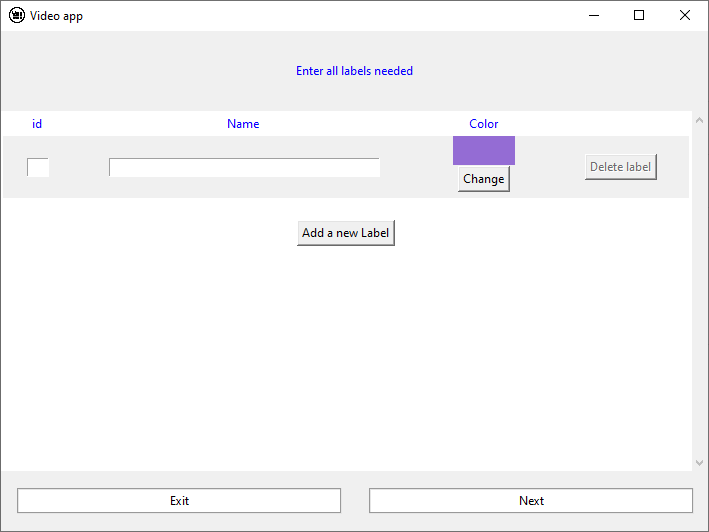
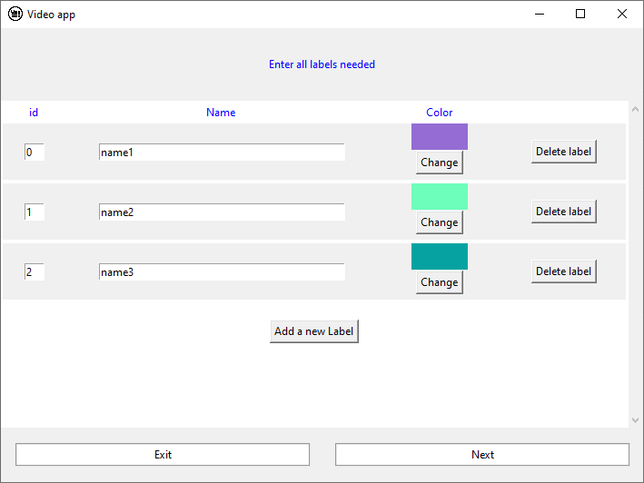
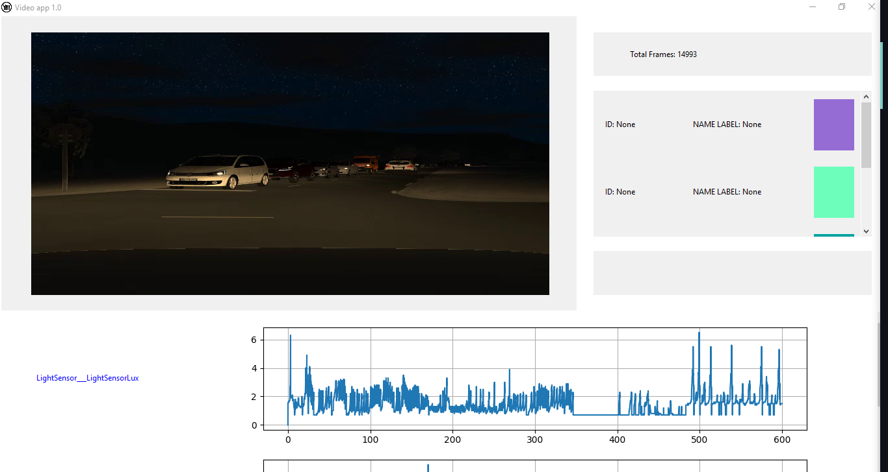

# How to use the program ?

This desktop app was created in order to automate the labeling of the simulation videos

### First steps 
When we run the ```launcher.py```, we'll have the *browser window*.



We have to select a *video* file (the simulation video) and a *CSV* file (the data).

>Check more details about the browser window [here](./signalsWindow.md)

Once selected, then we can start !

Then, we have to select all signals to work with (from th csv file) so make sure that select the goog csv file ! 

We're supposed to have a window like this :



Then, select all signals you will work with and validate them by "Next"

>Check more details about the signals window [here](./signalsWindow.md)

Next, we will have this window :



Here we will enter all label in order to labelize the video by its csv/excel file.

The folling example below shows an example of how to enter the data :



We can change the color default or the IDs or even the name of labels !

>Check more details about the labels window [here](./labelsWindow.md)

Once done, the program is ready to display the main window *(Where you will work)*

The image bellow is a beta version of the ```mainWindow.py``` :



We can divise the main in two parts: The **header** and the **body**.

* ****Header****: To the left side, there is the video selected in the first window. And in the right side, the labels entered before and some video infos as the frame's number and the buttons to handle the video.

* ****Body****: We will find here all the signals selected, that part will be useful in order to help the user to labelize better the file.

>Check more details about the main window [here](./mainWindow.md)